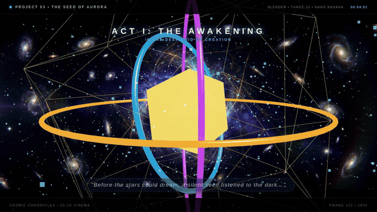
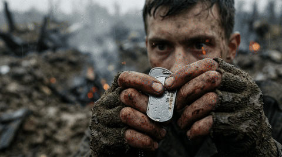
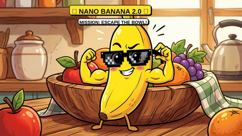

# VideoGen 🎬

A multi-project animated video generation hub powered by **Remotion**, **Three.js**, **Blender 5.0**, **Google Gemini 3.1 Flash Image ("Nano Banana 2")**, procedural audio synthesis, and FFmpeg.

This repository houses multiple self-contained, high-production animation and cinema projects.

---

## 📽️ Projects Directory

| Project Folder | Title & Description | Tech Stack | Duration | Framerate / Cuts | Total Frames | Status |
|---|---|---|---|---|---|---|
| [`cosmic_odyssey_03/`](./cosmic_odyssey_03/) | **The Seed of Aurora (Cosmic Odyssey)**: A 1-minute cinematic sci-fi odyssey tracking an ancient celestial seed through the deep void, across a kaleidoscopic nebula, plunging through atmospheric re-entry onto a desolate alien world, and blooming into an eternal solarpunk garden of stars. | Remotion + Three.js + Blender + Nano Banana 2 + WebGL | 60.0s | 30.0 FPS | 1,800 Frames | ✅ Complete |
| [`war_action_01/`](./war_action_01/) | **Brothers in Arms — No One Left Behind**: A hard-hitting, impactful cinematic war action film following a desperate combat rescue through artillery craters, smoke screens, suppressive tank armor, and A-10 close air support to extract a wounded brother onto a MEDEVAC Black Hawk into the sunset. | Nano Banana 2 + Dynamic Programming + FFmpeg | 30.0s | **4 FPS (Continuous Cut)**<br>+ 20 FPS (Smooth / Full) | 120 Continuous Frames<br>(from 600 AI Frames) | ✅ Complete |
| [`nano_banana_comedy_01/`](./nano_banana_comedy_01/) | **The Misadventures of Nano Banana 2.0**: A slapstick comedy animated short following a sentient banana escaping a kitchen fruit bowl, dodging a smoothie blender, outsmarting a hungry chef monkey, strapping to a bottle rocket, and slipping on its own peel. | Nano Banana 2 + Procedural SFX + FFmpeg | 30.0s | 20 FPS | 600 Frames | ✅ Complete |

---

## 🌌 Project 03: The Seed of Aurora (Cosmic Odyssey)

> *"Before the stars could dream, a silent seed listened to the dark. Driven by starlight, it travels through ancient nebulae, descends onto a barren dying world, impacts the stone, and blossoms into an eternal garden of stars."*

### Visual Preview


### Key Architectural Highlights
- **Remotion Framework**: Synchronizes 1,800 frames at 30 FPS across 5 distinct narrative acts with dynamic typography, chapter markers, timecodes, and audio alignment.
- **Three.js WebGL Engine**: Renders real-time 3D lighting, dynamic camera paths, a rotating multifaceted crystalline celestial seed, concentric gyroscope gimbal rings, and 1,500 procedural particles (hyperspace drift, plasma re-entry trails, expanding ground shockwaves, and floating bioluminescent spores).
- **Blender 5.0 Procedural Assets**: Generated via headless Python scripts (`blender/generate_assets.py`) to create clean GLTF/GLB models for the celestial seed core (`seed_artifact.glb`) and crystal monolith spires (`monolith_spire.glb`).
- **Nano Banana 2 Visual Matting**: 5 master cinematic widescreen (1376x768) matte paintings providing rich atmospheric backdrops with Ken Burns pan/zoom dynamics.
- **60-Second Master Soundtrack**: Procedural stereo 44.1 kHz orchestral score moving through 5 distinct musical movements matching each act.

---

## 🪖 Project 02: War Action — "No One Left Behind"

### Visual Preview (Continuous Cut)


### Available Video Cuts
- **`output/war_action_continuous.mp4` (4 FPS, 120 Frames, 23 MB)**: Filtered via global Dynamic Programming to select only frames with high visual and color continuity, eliminating rapid flicker and providing a stable, cinematic narrative flow.
- **`output/war_action_continuous_smooth.mp4` (20 FPS blended, 27 MB)**: Optical blend transitions between the 120 continuous frames for a smooth dissolve between shots.
- **`output/war_action_hardhitting.mp4` (20 FPS, 600 Frames, 70 MB)**: The original rapid-tempo montage containing all 600 individual AI-generated images.

---

## 🍌 Project 01: Nano Banana 2 Slapstick Comedy

### Visual Preview


---

## 📁 Repository Directory Structure

```
VideoGen/
├── README.md
├── .gitignore
├── cosmic_odyssey_03/              # Project 3: Remotion + Three.js + Blender + Nano Banana
│   ├── README.md                   # Full 5-act narrative and tech docs
│   ├── package.json
│   ├── remotion.config.ts
│   ├── tsconfig.json
│   ├── blender/                    # Headless Blender 3D scripts & GLB models
│   ├── nano_banana/                # Gemini Image Prompts & 5 Master matte paintings
│   ├── audio/                      # Procedural 60.0s orchestral score
│   ├── public/                     # Static assets for Remotion
│   ├── src/                        # Remotion + Three.js components & scenes
│   └── output/
│       ├── cosmic_odyssey_1min.mp4 # 60.0s Master Video (1280x720 @ 30 FPS)
│       └── cosmic_odyssey_preview.gif
├── war_action_01/                  # Project 2: Hard-hitting War Action (600 frames)
│   ├── README.md
│   ├── frames/                     # 600 individual AI images
│   ├── frames_continuous/          # 120 selected continuous frames
│   ├── audio/
│   ├── output/
│   └── scripts/
└── nano_banana_comedy_01/          # Project 1: Slapstick Comedy (600 frames)
    ├── README.md
    ├── frames/
    ├── audio/
    ├── output/
    └── scripts/
```
