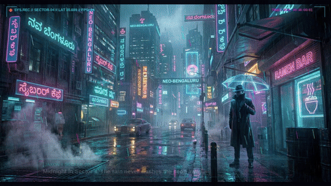
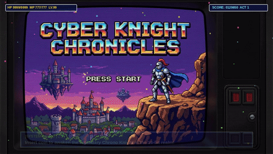
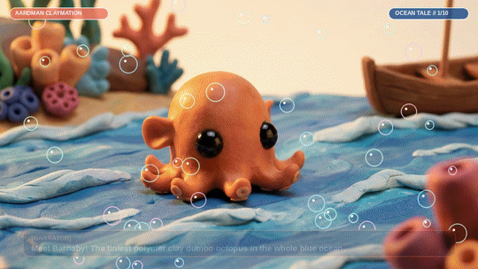
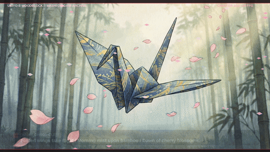
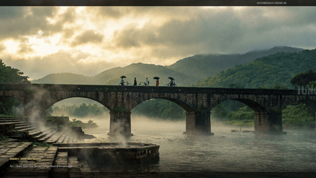

# VideoGen 🎬

A multi-project animated video generation hub powered by **Remotion**, **Three.js**, **Blender 5.0**, **Google Gemini ("Nano Banana 2")**, procedural DSP audio synthesis, continuous frame-by-frame physics rendering engines, and FFmpeg.

This repository houses multiple self-contained, high-production animation and cinema projects across diverse visual styles: Cyberpunk Neo-Noir, Ancient Egyptian Mythology, 16-Bit Retro Arcade, Tactile Underwater Claymation, Japanese Washi & Ukiyo-e Origami, 35mm Indian cinematic realism, Pixar 3D CGI animation, and Makoto Shinkai anime.

---

## 📽️ Projects Directory

| # | Project Folder | Title & Description | Visual Style | Subtitles | Animation Density | Duration | Output | Status |
|---|---|---|---|---|---|---|---|---|
| **07** | [`cyberpunk_neon_detective_07/`](./cyberpunk_neon_detective_07/) | **Cyberpunk Neon Detective**: Neo-noir detective investigation in Sector 4 — neon monsoon rain, encrypted holographic bio-chips, flying spinner chases, noodle bar informants, and quantum server vault heists. | **Blade Runner Cyberpunk Neo-Noir** | ✅ Burned-In Cyan HUD | 600 Frames (24 FPS) • 10 Scenes | 25.0s | MP4 + GIF | ✅ Complete |
| **08** | [`ancient_egypt_mythology_08/`](./ancient_egypt_mythology_08/) | **Ancient Egypt Mythology (ಖಗೋಳ ಈಜಿಪ್ಟ್ ಕಥೆ)**: Cosmic Egyptian mythology — sacred twilight Nile, Karnak temple columns, Golden Scarab of Khepri, Solar Barque crossing celestial waters, Weighing of the Heart before Anubis, and battle with Apep. | **Golden Age Egyptian Mythology** | ✅ Burned-In Gold Cartouche | 600 Frames (24 FPS) • 10 Scenes | 25.0s | MP4 + GIF | ✅ Complete |
| **09** | [`retro_pixel_arcade_quest_09/`](./retro_pixel_arcade_quest_09/) | **Retro Pixel Arcade Quest**: 16-bit SNES arcade fantasy RPG — insert coin boot sequence, forgotten byte dungeon, drawing the Glitch Slayer sword, turn-based battle, combo slashes, molten lava foundry, and Glitch Titan boss limit break. | **16-Bit Super Nintendo / Pixel Art** | ✅ Burned-In SNES Dialog Box | 600 Frames (24 FPS) • 10 Scenes | 25.0s | MP4 + GIF | ✅ Complete |
| **10** | [`claymation_underwater_odyssey_10/`](./claymation_underwater_odyssey_10/) | **Claymation Underwater Odyssey**: Tactile Aardman stop-motion short following Barnaby the dumbo octopus — playful sea turtles, bioluminescent jellyfish disco, toothy anglerfish guides, sunken pirate galleons, and rainbow pearls. | **Tactile Stop-Motion Claymation** | ✅ Burned-In Coral Clay Placard | 600 Frames (24 FPS) • 10 Scenes | 25.0s | MP4 + GIF | ✅ Complete |
| **11** | [`origami_sakura_samurai_11/`](./origami_sakura_samurai_11/) | **Origami Sakura Samurai**: Handcrafted Japanese washi paper & woodblock watercolor art — folded crane flights, bamboo bridge contemplations, swirling cherry blossom storms, Ink Dragon clashes, and sacred paper crane flock summons. | **Washi Origami & Ukiyo-e Woodblock** | ✅ Burned-In Rice Paper Scroll | 600 Frames (24 FPS) • 10 Scenes | 25.0s | MP4 + GIF | ✅ Complete |
| **04** | [`shivamogga_kannada_drama_04/`](./shivamogga_kannada_drama_04/) | **ಶಿವಮೊಗ್ಗ ನಾಟಕ (Shivamogga Kannada Drama)**: A rich emotional drama across the Malnad heartland — misty Tunga bridge at dawn, river ghat arati, courtyard coffee, sepia photo tear, Rangamandira stage clash, Western Ghats monsoon downpour, Jog Falls lightning tempest, and sacred banyan reunion. | **Cinematic Realism (35mm Indian Cinema)** | — | 600 Frames (24 FPS) • 10 Scenes | 25.0s | MP4 + GIF | ✅ Complete |
| **05** | [`cute_puppy_spotlight_05/`](./cute_puppy_spotlight_05/) | **Cute Puppy Spotlight**: Heartwarming 3D animation spotlight following a curious golden pup from wicker basket yawns and clumsy kitchen stumbles to popping rainbow bubbles, garden butterfly chases, autumn leaf vortexes, and fireplace lullabies. | **Pixar / Disney 3D CGI Animation** | — | 600 Frames (24 FPS) • 10 Scenes | 25.0s | MP4 + GIF | ✅ Complete |
| **06** | [`social_media_screenless_06/`](./social_media_screenless_06/) | **Disconnect to Reconnect (デスコネクト リコネクト)**: An evocative film portraying the suffocating doomscroll cycle and anxiety of screen addiction, followed by the deep liberation of powering off, open morning windows, walking in dew-kissed cedar forests, real friendship, and twilight ocean breezes. | **Makoto Shinkai & Ghibli Anime** | — | 600 Frames (24 FPS) • 10 Scenes | 25.0s | MP4 + GIF | ✅ Complete |
| **03** | [`cosmic_odyssey_03/`](./cosmic_odyssey_03/) | **The Seed of Aurora (Cosmic Odyssey)**: A 1-minute sci-fi odyssey tracking an ancient celestial seed through the deep void, across a kaleidoscopic nebula, into alien atmospheric re-entry, blooming into an eternal solarpunk garden of stars. | **Sci-Fi 3D WebGL & Matte Painting** | — | Multi-Layer WebGL 3D | 60.0s | MP4 + GIF | ✅ Complete |
| **02** | [`war_action_01/`](./war_action_01/) | **Brothers in Arms — No One Left Behind**: A combat rescue mission through artillery craters, smoke screens, suppressive tank armor, and A-10 close air support to extract a wounded brother onto a MEDEVAC Black Hawk. | **Gritty Military Action** | — | 600 Frames (20 FPS) | 30.0s | MP4 + GIF | ✅ Complete |
| **01** | [`nano_banana_comedy_01/`](./nano_banana_comedy_01/) | **The Misadventures of Nano Banana 2.0**: Slapstick comedy animated short following a sentient banana escaping a kitchen fruit bowl, dodging a smoothie blender, and strapping to a bottle rocket. | **Stylized Slapstick Cartoon** | — | 600 Frames (20 FPS) | 30.0s | MP4 + GIF | ✅ Complete |

---

## 🌆 Project 07: Cyberpunk Neon Detective (Blade Runner Neo-Noir)

> *"Midnight in Sector 4. The rain never washes the neon away."*

### Visual Preview


- **Style**: Blade Runner neo-noir cyberpunk with atmospheric industrial smog, wet reflective asphalt, and piercing holographic neon signs.
- **Continuous Animation Engine**: 600 rendered frames (24 FPS, 25.0s) featuring 80 falling neon rain streaks with wind drift, CRT scanlines, cyber HUD crosshairs and timecodes, and burned-in frosted-glass subtitle cards with cyan glow borders.
- **Key Scenes (10 Acts)**: Monsoon alley, holographic clue, flying hover traffic, noodle bar informant, subway chase, rooftop overlook, quantum server vault, cyber syndicate confrontation, memory extracted, neon dawn.
- **Soundtrack**: Analog sawtooth synth bass (120 BPM), Vangelis CS-80 lead synths, filtered rain ambiance, and police siren echoes.

---

## 𓂀 Project 08: Ancient Egypt Mythology (Epic Mythological Realism)

> *"Before the dawn of dynasties, the sacred river reflected the eternal stars."*

### Visual Preview


- **Style**: Grand classical Egyptian mythological cinema with golden sunlight, towering hieroglyphic columns, lapis lazuli accents, and divine cosmic scale.
- **Continuous Animation Engine**: 600 rendered frames (24 FPS, 25.0s) featuring swirling golden desert sand particles, torch fire embers, celestial solar rays, and burned-in dark papyrus subtitle placards with gold leaf borders.
- **Key Scenes (10 Acts)**: Nile twilight, Karnak temple columns, golden scarab of Khepri, celestial solar barque voyage, underworld gates of Duat, weighing of the heart before Ma'at, wrath of Ra vs Apep, Horus triumphant, dawn over Giza pyramids, eternal hymn of Egypt.
- **Soundtrack**: Egyptian Bayati/Hijaz modal scales, wooden Nay flute vibrato, sacred Darbuka/Tar percussion, bronze Sistrum rattles, and divine solar brass.

---

## 🕹️ Project 09: Retro Pixel Arcade Quest (16-Bit Super Nintendo)

> *"Insert coin to awaken the legendary Chrono Knight in the 16-bit realm!"*

### Visual Preview


- **Style**: Authentic 16-bit Super Nintendo pixel art with vibrant color palettes, CRT monitor curvature, and retro RPG battle layouts.
- **Continuous Animation Engine**: 600 rendered frames (24 FPS, 25.0s) featuring 8-bit particle sparks, CRT horizontal scanlines, screen-shake combat impact feedback, top RPG stats HUD, and classic blue SNES dialogue boxes with blinking arrow cursors.
- **Key Scenes (10 Acts)**: Title boot screen, dungeon awakening, legendary sword altar, turn-based monster encounter, combo slash critical strike, boiling lava bridge, cyber glitch titan encounter, ultimate limit break blast, boss defeat fanfare, arcade dimension portal.
- **Soundtrack**: 140 BPM pulse-width square wave leads (12.5%/25%/50% duty), punchy triangle sub-bass, 8-bit white noise drum kit, and coin collection fanfares.

---

## 🐙 Project 10: Claymation Underwater Odyssey (Tactile Stop-Motion)

> *"Meet Barnaby! The tiniest polymer clay dumbo octopus in the whole blue ocean."*

### Visual Preview


- **Style**: Hand-sculpted polymer clay stop-motion in the tradition of Aardman Animation, with visible clay fingerprint textures and bright pastel palettes.
- **Continuous Animation Engine**: 600 rendered frames (24 FPS, 25.0s) featuring tactile 12-FPS clay wiggle keying, floating polymer bubbles with wobbling physics and specular highlights, top studio banner, and rounded coral clay subtitle cards.
- **Key Scenes (10 Acts)**: Surface water splash, colorful coral reef, playful sea turtle high-five, deep twilight descent, bioluminescent jellyfish disco, friendly anglerfish guide, sunken pirate galleon, glowing treasure chest, rainbow pearl dance, cotton-candy sunset return.
- **Soundtrack**: 110 BPM acoustic wooden marimba melodies, bouncy pizzicato double bass, resonant bubble pops, and iridescent pearl glockenspiel chimes.

---

## 🌸 Project 11: Origami Sakura Samurai (Washi & Ukiyo-e Woodblock)

> *"A warrior's soul is like folded washi paper: humble, yet unbreakable."*

### Visual Preview


- **Style**: Japanese washi paper origami, Ukiyo-e woodblock print textures, and traditional Sumi-e black calligraphy ink wash.
- **Continuous Animation Engine**: 600 rendered frames (24 FPS, 25.0s) featuring 50 fluttering pink cherry blossom petals with 3D polygon rotation, Sumi-e ink droplets, top woodblock banner, and rice paper scroll subtitle cards with vermilion borders and red Japanese seal stamps.
- **Key Scenes (10 Acts)**: Folded paper crane flight, misty bamboo bridge, mountain sakura gale, ink dragon awakening, drawing silver foil katana, blossom clash impact, flock of thousand paper cranes, dragon dissolve into petals, sheathing blade at dawn, eternal harmony over Mount Fuji.
- **Soundtrack**: 13-string Koto plucks in Insen scale with pitch bends, airy Shakuhachi bamboo flute, thunderous 55Hz Taiko drum impacts, and Hyoshigi wooden clappers.

---

## 🎭 Project 04: Shivamogga Kannada Drama — "ಶಿವಮೊಗ್ಗ ನಾಟಕ"

> *"ತುಂಗಾ ತೀರದ ಮುಂಜಾನೆಯಿಂದ ಜೋಗ ಜಲಪಾತದ ರೌದ್ರ ಗಾಂಭೀರ್ಯದವರೆಗೆ — ನೆನಪುಗಳು, ರಂಗಭೂಮಿ ಹಾಗೂ ಕರುಳಿನ ಬಾಂಧವ್ಯದ ಕಥೆ."*

### Visual Preview


- **Style**: Photorealistic 35mm Indian Cinematic Drama with rich Malnad regional aesthetics.
- **Continuous Animation Engine**: 600 rendered frames (24 FPS, 25.0s) featuring rolling river mist drift, flickering multi-tier brass arati flames, rising camphor smoke, sliding tear refractive physics on photo glass, swinging Rangamandira stage spotlight, torrential Western Ghats directional rain downpour, Jog Falls lightning sheet flash & camera thunder tremor, and golden clearing sunbeams.
- **Key Scenes (10 Acts)**: Tunga bridge dawn, river ghat arati, courtyard morning coffee, sepia photo tear, Rangamandira stage rehearsal, emotional actor breakdown, monsoon downpour road, Jog Falls storm abyss, temple courtyard drizzle, sacred banyan brotherly embrace.
- **Soundtrack**: Raag Bhoopali / Mohanam scale in C# with micro-tonal Bansuri flute, meditative Tanpura drone, Tala Roopaka Tabla (bayan bass modulations), and resonant temple bells.

---

## 🐾 Project 05: Cute Puppy Spotlight (Pixar 3D Animation)

> *"A day in the life of the fluffiest golden explorer — curious bubbles, flying ears, and sweet bedtime dreams."*

### Visual Preview


- **Style**: Pixar / Disney 3D CGI animation with volumetric lighting, soft subsurface scattering fur, and expressive facial animation.
- **Continuous Animation Engine**: 600 rendered frames (24 FPS, 25.0s) featuring golden morning dust motes, clumsy tumble camera bounce and squash, floating iridescent soap bubbles with surface tension wobbles, bubble pop physics into 32 animated water droplets, animated flying blue butterfly with flapping wings and fairy dust trails, squeaky ball roll with kicking leaf rooster tails, spring peek-a-boo bounce, and rising hearth fire embers.
- **Key Scenes (10 Acts)**: Sunlit basket yawn, clumsy kitchen tumble, giant bubble wonder, bubble pop on nose surprise, tulip garden butterfly chase, butterfly resting on nose, rolling squeaky ball, autumn leaf peek-a-boo, cozy fireplace snuggle, dreaming paws with floating dream bubbles.
- **Soundtrack**: Playful pizzicato strings (170 BPM allegro), marimba/xylophone mallet melodies, procedural puppy yelps/barks, and a warm hearth lullaby.

---

## 🍃 Project 06: Social Media vs Screenless Time — "Disconnect to Reconnect"

> *"When the screen goes dark, the real world begins."*

### Visual Preview


- **Style**: Makoto Shinkai & Studio Ghibli cinematic anime art with dramatic sky gradients, radiant sunbeams, and lush hand-painted nature.
- **Continuous Animation Engine**: 600 rendered frames (24 FPS, 25.0s) featuring vertical CRT scanline rolling, chaotic notification badge explosion (+999, VIRAL ALERT, ERROR) with screen jitter and digital glitch slices, CRT line collapse power-down, billowing white curtains and fluttering hair, flying birds with flapping wing physics, 25 drifting dandelion seeds in wind turbulence, rotating Komorebi sunbeam spokes, hot tea curling smoke, sketchbook drawing pencil line animation, ocean wave specular sparkles, and an animated shooting star with glowing ion tail.
- **Key Scenes (10 Acts)**: Midnight doomscroll gloom, notification overload anxiety, powering off into calm, open bedroom window morning breeze, stepping into living cedar forest, sunlight canopy komorebi, shared tea with real friends, meadow sketchbook drawing, twilight ocean cliffside, starlit galaxy with shooting star.
- **Soundtrack**: Cold square-wave glitch pings & haptic buzzes transforming abruptly at the power-off click into an emotional acoustic grand piano melody, birdsong, ocean surf, and soaring orchestral strings.

---

## 📁 Repository Directory Structure

```
VideoGen/
├── README.md
├── .gitignore
├── cyberpunk_neon_detective_07/     # Project 7: Cyberpunk Neo-Noir (Burned-In Subtitles)
│   ├── README.md                    # 10-scene transcript, VFX & audio breakdown
│   ├── scenes/                      # 10 Master keyframe scenes (16:9 4K)
│   ├── frames/                      # 600 rendered continuous animation frames
│   ├── audio/                       # Procedural synthwave score (.wav)
│   ├── output/                      # 25s MP4 video + animated preview GIF
│   └── scripts/                     # render_animation_frames.py & compile_video.py
├── ancient_egypt_mythology_08/      # Project 8: Ancient Egypt Mythology (Subtitles)
│   ├── README.md                    # 10-scene transcript, VFX & audio breakdown
│   ├── scenes/                      # 10 Master keyframe scenes (16:9 4K)
│   ├── frames/                      # 600 rendered continuous animation frames
│   ├── audio/                       # Procedural Egyptian modal score (.wav)
│   ├── output/                      # 25s MP4 video + animated preview GIF
│   └── scripts/                     # render_animation_frames.py & compile_video.py
├── retro_pixel_arcade_quest_09/     # Project 9: 16-Bit Pixel Arcade (Subtitles)
│   ├── README.md                    # 10-scene transcript, VFX & audio breakdown
│   ├── scenes/                      # 10 Master keyframe scenes (16:9 4K)
│   ├── frames/                      # 600 rendered continuous animation frames
│   ├── audio/                       # Procedural 16-bit SNES chiptune score (.wav)
│   ├── output/                      # 25s MP4 video + animated preview GIF
│   └── scripts/                     # render_animation_frames.py & compile_video.py
├── claymation_underwater_odyssey_10/# Project 10: Tactile Claymation (Subtitles)
│   ├── README.md                    # 10-scene transcript, VFX & audio breakdown
│   ├── scenes/                      # 10 Master keyframe scenes (16:9 4K)
│   ├── frames/                      # 600 rendered continuous animation frames
│   ├── audio/                       # Procedural marimba & bubble score (.wav)
│   ├── output/                      # 25s MP4 video + animated preview GIF
│   └── scripts/                     # render_animation_frames.py & compile_video.py
├── origami_sakura_samurai_11/       # Project 11: Origami Samurai (Subtitles)
│   ├── README.md                    # 10-scene transcript, VFX & audio breakdown
│   ├── scenes/                      # 10 Master keyframe scenes (16:9 4K)
│   ├── frames/                      # 600 rendered continuous animation frames
│   ├── audio/                       # Procedural Koto & Taiko score (.wav)
│   ├── output/                      # 25s MP4 video + animated preview GIF
│   └── scripts/                     # render_animation_frames.py & compile_video.py
├── shivamogga_kannada_drama_04/     # Project 4: Kannada Drama (Shivamogga / Malnad)
├── cute_puppy_spotlight_05/         # Project 5: Cute Puppy Spotlight (Pixar 3D)
├── social_media_screenless_06/      # Project 6: Disconnect to Reconnect (Anime)
├── cosmic_odyssey_03/               # Project 3: Remotion + Three.js + Blender
├── war_action_01/                   # Project 2: Hard-hitting War Action (600 frames)
└── nano_banana_comedy_01/           # Project 1: Slapstick Comedy (600 frames)
```
