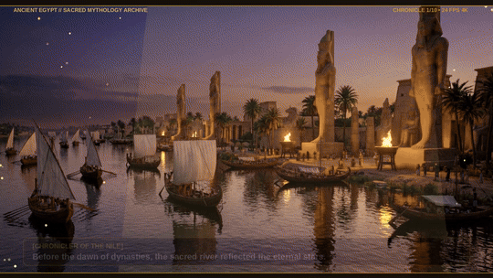

# Ancient Egypt Mythology 𓂀 : 600-Frame Epic Mythological Animation

A 25.0-second continuous animated mythological suite rendered across **600 individual animation frames** (24 FPS) featuring burned-in hieroglyphic cartouche subtitles, drifting golden desert sand particles, temple torch fire embers, celestial solar rays, and procedural Egyptian Bayati/Hijaz modal orchestral music.

---

## 📽️ Visual Preview

---

## 🎬 10 Narrative Scenes with Burned-In Subtitles (60 Frames Each)

| Scene | Frames | Keyframe File | Subtitle Speaker & Narrative Script | Visual & Particle VFX |
|---|---|---|---|---|
| **Scene 01** | 001 - 060 | `scenes/scene01_nile_twilight.png` | **[CHRONICLER OF THE NILE]**: *"Before the dawn of dynasties, the sacred river reflected the eternal stars."* | Golden twilight water reflections, starry night sky, slow panoramic tilt. |
| **Scene 02** | 061 - 120 | `scenes/scene02_karnak_pillars.png` | **[HIGH PRIEST AMUN-RA]**: *"Enter Karnak's sacred columns... Where incense rises to meet the gods."* | Drifting ceremonial incense smoke, flickering torch fire sparks, pillar shadows. |
| **Scene 03** | 121 - 180 | `scenes/scene03_golden_scarab.png` | **[INVOCATION OF KHEPRI]**: *"By the Golden Scarab, let Ra awaken the cosmic breath of life across the land."* | Shimmering lapis and gold reflections, glowing hieroglyphic aura pulse. |
| **Scene 04** | 181 - 240 | `scenes/scene04_solar_bark.png` | **[THE CELESTIAL VOYAGE]**: *"The Solar Barque sets sail across the sapphire celestial waters of Nut."* | Cosmic sapphire celestial water ripples, golden hull radiance, solar flares. |
| **Scene 05** | 241 - 300 | `scenes/scene05_duat_gates.png` | **[ANUBIS // WEIGHER OF HEARTS]**: *"Tread softly, mortal soul. You stand before the Twelve Gates of the Underworld."* | Eerie underworld mist, glowing blue spirit flames, imposing stone gate reveal. |
| **Scene 06** | 301 - 360 | `scenes/scene06_weighing_heart.png` | **[JUDGMENT OF MA'AT]**: *"The heart is placed upon the scale... lighter than the ostrich feather of truth."* | Golden balance scale equilibrium motion, shimmering feather glow particles. |
| **Scene 07** | 361 - 420 | `scenes/scene07_apep_battle.png` | **[THE WRATH OF RA]**: *"Apep, serpent of chaos, shall be smitten by the spears of blinding solar fire!"* | Blinding golden solar spear beams, thrashing shadow coils, energy shockwaves. |
| **Scene 08** | 421 - 480 | `scenes/scene08_horus_triumph.png` | **[HORUS VICTORIOUS]**: *"With wings of gold and lapis lazuli, the Eye of Horus restores divine cosmic order."* | Radiant golden falcon wings spreading, divine crown shimmer, sacred light beams. |
| **Scene 09** | 481 - 540 | `scenes/scene09_giza_pyramids_dawn.png` | **[DAWN OVER GIZA]**: *"The golden capstones catch the first morning rays... Immortality etched in limestone."* | Morning sunlight catching electrum pyramidion caps, shimmering heat mirage. |
| **Scene 10** | 541 - 600 | `scenes/scene10_eternal_egypt.png` | **[ETERNAL HYMN OF RA]**: *"Fertile lands, flowing Nile, eternal glory. Egypt shines under the everlasting sun."* | Wide panoramic river vista, drifting desert sand motes, eternal sunrise radiance. |

---

## 🎵 Procedural Egyptian Modal Soundtrack (`scripts/generate_soundtrack.py`)
- **Bayati & Hijaz Maqam Modes**: Traditional Near Eastern melodic intervals with authentic emotional tension.
- **Wooden Nay Flute**: Expressive breath vibrato and microtonal ornamentation.
- **Sacred Darbuka & Tar**: Rhythmic Dum-Tek percussion patterns grounding the ancient tempo.
- **Bronze Sistrum Rattles**: Metallic shaking percussion replicating temple rituals.
- **Divine Solar Horns**: Resonant bronze brass blasts representing the triumph of Ra.

---

## 🛠️ Video Pipeline (`scripts/render_animation_frames.py` & `scripts/compile_video.py`)
- **Frames**: 600 individual rendered frames (`frames/frame_0001.jpg` - `frames/frame_0600.jpg`)
- **Multi-Core Render**: Parallel 16-thread processing using PIL and `concurrent.futures`
- **Output Video**: `output/ancient_egypt_mythology.mp4` (1280x720 Progressive, H.264 CRF 18, 24 FPS, AAC audio)
- **Preview GIF**: `output/ancient_egypt_mythology_preview.gif` (Lanczos palette generation)
