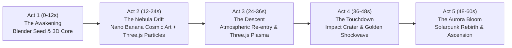

# Project 03: The Seed of Aurora (Cosmic Odyssey)

A **1-minute (60.00-second) cinematic 3D film** uniting **Remotion**, **Three.js**, **Blender**, and **Google Gemini 3.1 Flash Image ("Nano Banana 2")** to tell a complete, emotionally resonant story of cosmic genesis and rebirth.

---

## 🌌 The Narrative Arc: "The Seed of Aurora"

> *"Before the stars could dream, a silent seed listened to the dark. Driven by starlight, it travels through ancient nebulae, descends onto a barren dying world, impacts the stone, and blossoms into an eternal garden of stars."*



### 5-Act Breakdown (60.0 Seconds | 30 FPS = 1,800 Frames)

| Act | Timestamp | Frames | Scene & Action | Technology Integration | Musical Score & Audio Design |
|---|---|---|---|---|---|
| **Act I: The Awakening** | 0:00 - 0:12 | 000 - 360 | Deep space void. An ancient geometric celestial seed awakens; internal crystalline facets glow; sacred gyroscopic rings spin. | **Blender** procedural 3D model (`seed_artifact.glb`) + **Three.js** dynamic lighting and rotational kinematics in **Remotion**. | Sub-bass 43.65 Hz drone, celestial chime arpeggios, spatial atmospheric resonance. |
| **Act II: The Nebula Drift** | 0:12 - 0:24 | 360 - 720 | The seed glides through a purple-magenta stellar nursery. The crystal blooms open, absorbing starlight. | **Nano Banana** deep space nebula canvas + **Three.js** 1,500-particle stardust vortex streaming toward camera. | Warm analog synthesizer pads (Fm9 -> AbMaj7 -> Eb), 60 BPM stardust pulse. |
| **Act III: The Descent** | 0:24 - 0:36 | 720 - 1080 | Approaching a desolate volcanic planet. The seed enters the violet ionosphere, trailing glowing plasma fire and runic glyphs. | **Nano Banana** planetary ionosphere canvas + **Three.js** plasma particle tail & camera shake in **Remotion**. | Heavy atmospheric entry rumble, descending friction roar, low brass braam horns. |
| **Act IV: The Touchdown** | 0:36 - 0:48 | 1080 - 1440 | Impact in an ancient stone canyon. A golden resonance shockwave expands radially, waking glowing bioluminescent veins across the ground. | **Three.js** radial shockwave rings & ground grid illumination + **Nano Banana** fractured canyon crater matte. | 36.0s seismic impact concussion blast, crystalline reverb shatter, rising harmonic pulse. |
| **Act V: The Aurora Bloom** | 0:48 - 1:00 | 1440 - 1800 | The barren stone transforms into a lush solarpunk paradise: glowing flora, towering crystal monoliths, and twin suns rising over an emerald ocean. The seed ascends as an eternal guardian star. | **Blender** monolith geometry (`monolith_spire.glb`) + **Nano Banana** solarpunk paradise backdrop + **Three.js** floating spores + **Remotion** kinetic typography. | Triumphant orchestral crescendo (F -> Bb -> C -> F), angelic choir swells, peaceful resolution. |

---

## 🛠️ Multi-Engine Pipeline Architecture

```
┌────────────────────────────────────────────────────────────────────────┐
│                        Remotion Video Engine                           │
│  (React 18 / Composition Timeline @ 30 FPS / Headless Chrome Renderer) │
└───────┬──────────────────────────┬──────────────────────────┬──────────┘
        │                          │                          │
        ▼                          ▼                          ▼
┌──────────────────┐      ┌──────────────────┐      ┌──────────────────┐
│     Three.js     │      │     Blender      │      │   Nano Banana    │
│  (@remotion/     │      │ (Headless CLI    │      │ (Gemini 3.1      │
│   three / Fiber) │      │  Python Engine)  │      │  Flash Image)    │
│                  │      │                  │      │                  │
│ • Real-time 3D   │      │ • Procedural 3D  │      │ • Deep space     │
│   WebGL viewport │      │   celestial seed │      │   nebula art     │
│ • Dynamic orbital│      │ • Concentric     │      │ • Alien planet   │
│   camera paths   │      │   gimbal rings   │      │   horizons       │
│ • Procedural     │      │ • Monolith spire │      │ • Solarpunk      │
│   particle fields│      │ • GLTF/GLB export│      │   bloom matte    │
└──────────────────┘      └──────────────────┘      └──────────────────┘
```

1. **Blender (`blender/generate_assets.py`)**:
   - Runs headless via `blender -b -P blender/generate_assets.py`.
   - Procedurally constructs:
     - `seed_artifact.glb`: Multifaceted crystalline icosahedron core, 3 concentric gimbal torus rings, and outer stellated wireframe cage.
     - `monolith_spire.glb`: Crystalline alien obelisk with bevel modifiers and floating energy crown.
2. **Nano Banana (`nano_banana/generate_backdrops.py`)**:
   - Generates 5 ultra-detailed 16:9 widescreen master matte paintings for each narrative act.
   - Preserved in `nano_banana/images/` and served via Remotion's `staticFile()`.
3. **Three.js (`src/components/ThreeCanvasWrapper.tsx`)**:
   - Integrated with Remotion via `@remotion/three`.
   - Dynamically animates 3D meshes, directional/point lights, and particle systems frame-by-frame synced with Remotion's timeline.
4. **Remotion Composition (`src/Composition.tsx`)**:
   - Coordinates all layers: 3D canvas, Ken Burns background zooms, anamorphic letterboxes, chapter titles, poetic narration subtitles, and timecodes.
   - Synchronizes with the 60.00-second 44.1 kHz stereo master soundtrack (`audio/cosmic_soundtrack.wav`).

---

## 📁 Project Structure

```
cosmic_odyssey_03/
├── package.json                   # Remotion, Three.js, React dependencies
├── remotion.config.ts             # Headless Chromium & OpenGL render config
├── tsconfig.json                  # TypeScript compiler settings
├── README.md                      # Complete project documentation
├── blender/
│   ├── generate_assets.py         # Headless Blender procedural 3D modeling script
│   └── models/
│       ├── seed_artifact.glb      # 3D Celestial Seed Artifact
│       └── monolith_spire.glb     # 3D Alien Monolith Spire
├── nano_banana/
│   ├── generate_backdrops.py      # Gemini Image prompt generator
│   └── images/
│       ├── act1_void.png          # Act 1 Master Matte Painting
│       ├── act2_nebula.png        # Act 2 Master Matte Painting
│       ├── act3_descent.png       # Act 3 Master Matte Painting
│       ├── act4_impact.png        # Act 4 Master Matte Painting
│       └── act5_bloom.png         # Act 5 Master Matte Painting
├── audio/
│   ├── generate_soundtrack.py     # Procedural 60.0s orchestral score synthesizer
│   └── cosmic_soundtrack.wav      # Master 60.00s 44.1kHz stereo audio
├── public/                        # Static assets served to Remotion bundler
│   ├── audio/
│   ├── images/
│   └── models/
├── src/
│   ├── index.ts                   # Remotion root entrypoint
│   ├── Root.tsx                   # Remotion Root (1280x720 @ 30 FPS, 1800 frames)
│   ├── Composition.tsx            # Master Composition orchestrating 5 Acts
│   ├── types.ts                   # Act metadata, timestamps, color schemes
│   ├── components/
│   │   ├── BackdropKenBurns.tsx   # Cinematic slow pan/zoom on AI backdrops
│   │   ├── ThreeCanvasWrapper.tsx # Three.js 3D WebGL viewport
│   │   ├── CosmicSeed3D.tsx       # 3D animated celestial seed
│   │   ├── ParticleVortex3D.tsx   # 3D procedural particle systems
│   │   └── CinematicOverlay.tsx   # Letterboxes, kinetic typography & timecode
│   └── scenes/
│       └── ActScene.tsx           # Multi-layered scene compositor
└── output/
    ├── cosmic_odyssey_1min.mp4    # 60.0s Master Video (H.264 + AAC Stereo)
    └── cosmic_odyssey_preview.gif # High-res animated preview GIF
```

---

## 🎬 Technical Specifications

- **Total Duration**: Exactly 60.00 seconds (1 minute).
- **Frame Rate**: 30.00 FPS.
- **Total Frames**: Exactly 1,800 frames.
- **Resolution**: 1280 × 720 (16:9 Widescreen HD).
- **Video Codec**: H.264 / AVC (High Profile).
- **Audio Codec**: AAC Stereo (44,100 Hz, 16-bit).
- **Video Bitrate**: ~4.5 Mbps.
- **Audio Bitrate**: 192 kbps.

---

## 🚀 Reproduction Commands

```bash
# 1. Install dependencies
npm install

# 2. Re-generate Blender 3D models
blender -b -P blender/generate_assets.py

# 3. Re-generate 60s soundtrack
python3 audio/generate_soundtrack.py

# 4. Preview in browser
npm run preview

# 5. Render Master 60.0s Video
npm run build
```
