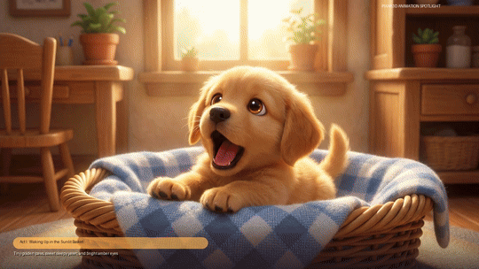

# Cute Puppy Spotlight 🐾 : Pixar 3D Animated Short
*(A Day in the Life of a Curious Golden Retriever Pup)*

A 25-second heartwarming 3D animation spotlight produced in the **Disney / Pixar 3D CGI Animation** visual style.

---

## 📽️ Visual Preview

---

## 🎬 Narrative Acts

| Act | Scene | Visual Setting | Narrative Beat |
|---|---|---|---|
| **Act I** | `scenes/scene1_basket_yawn.png` | Cozy wicker basket, blue checkered blanket, morning sunbeams | **Waking Up in the Sunlit Basket**: Adorable sleepy yawn, stretching tiny paws, sparkling amber eyes |
| **Act II** | `scenes/scene2_bubble_wonder.png` | Lush green lawn with pastel flowers | **The Floating Bubble Wonder**: Head tilt in sheer curiosity as an iridescent rainbow bubble floats by |
| **Act III** | `scenes/scene3_garden_butterfly.png` | Vibrant spring garden of bright pink and yellow tulips | **The Joyful Garden Sprint**: Kinetic mid-air bound chasing a glowing blue butterfly with flying ears |
| **Act IV** | `scenes/scene4_autumn_ball.png` | Sun-dappled autumn forest floor of amber leaves | **Golden Leaves & The Squeaky Ball**: Joyful slide into autumn leaves clutching a bright red rubber ball |
| **Act V** | `scenes/scene5_fireplace_dream.png` | Warm living room hearth rug before crackling fireplace | **Cozy Fireplace Lullaby**: Curled up fast asleep hugging a miniature brown teddy bear |

---

## 🎵 Procedural Soundtrack Design (`scripts/generate_soundtrack.py`)
- **Bouncy Pizzicato String Bass**: Plucked cello/violin walking groove at 170 BPM allegro tempo in C Major.
- **Orchestral Flute & Glockenspiel**: Sparkling fairy-tale chimes and melodic staccato woodwind motifs.
- **Marimba & Xylophone Melody**: Playful percussive mallet melodies capturing puppy steps and playful bounds.
- **Puppy Foley FX**: Procedural formant synthesis generating authentic high-pitched puppy yips and happy barks.
- **Fireplace Ambience & Bedtime Lullaby**: Ambient warm hearth crackle with a sweet C-Major string quartet lullaby finale.

---

## 🛠️ Video Pipeline (`scripts/compile_video.py`)
- **Resolution**: 1280x720 Progressive (16:9 Widescreen) @ 25 FPS
- **Cinematography**: Dynamic subpixel Ken Burns camera moves focusing on puppy micro-expressions and kinetic leaps.
- **Transitions**: 15-frame smooth optical cross-dissolves between scenes.
- **Styling**: Pixar-style pastel badge overlays with soft drop shadows and golden highlights.
- **Audio Codec**: AAC stereo @ 192 kbps.
