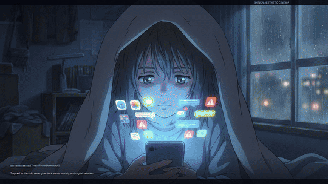

# Disconnect to Reconnect : デスコネクトとリコネクト 🍃 : 600-Frame Anime Film
*(The Downsides of Social Media & The Beauty of Screenless Time)*

A 25-second continuous cinematic anime short film rendered across **600 individual animation frames** (24 FPS) in the **Makoto Shinkai & Studio Ghibli** aesthetic. It illustrates the stark contrast between the digital doomscroll loop and the profound serenity of nature, real human presence, and starlight.

---

## 📽️ Visual Preview

---

## 🎬 10 Continuous Narrative Acts (60 Frames Each)

| Act | Frames | Keyframe File | Narrative & Dynamic Animation Action |
|---|---|---|---|
| **Act I** | 001 - 060 | `scenes/scene01_digital_doomscroll.png` | **深夜の闇とスクロール (The Infinite Doomscroll)**: Claustrophobic camera push-in, rolling vertical CRT scanlines, cold blue screen glare flickering on tired anime eyes. |
| **Act II** | 061 - 120 | `scenes/scene02_notification_overload.png` | **通知の嵐と精神の限界 (Notification Overload & Anxiety)**: Erratic screen jitter and shake, red notification count badges rapidly multiplying (+999, VIRAL ALERT, SYSTEM ERROR), horizontal digital glitch slice artifacts. |
| **Act III** | 121 - 180 | `scenes/scene03_powering_off.png` | **電源を切る静寂 (The Choice to Power Off)**: Screen power-down collapse to a bright white line and instant calm, subtle warm morning light creeping into the room as anxiety dissipates. |
| **Act IV** | 181 - 240 | `scenes/scene04_opening_window_breeze.png` | **開かれた窓と朝の光 (Open Windows & The Morning Breeze)**: Billowing white curtains, hair caught in fresh morning wind, radiant golden sunbeams, birds in flight with flapping wing physics. |
| **Act V** | 241 - 300 | `scenes/scene05_forest_sunlight.png` | **生きている森への一歩 (First Steps into the Living Cedar Forest)**: Walking camera motion through moss, 25 procedural dandelion seeds drifting in turbulent wind currents, emerald morning fog. |
| **Act VI** | 301 - 360 | `scenes/scene06_sunlight_canopy.png` | **木漏れ日と緑の呼吸 (Komorebi — Sunlight through the Canopy)**: Dramatic rotational tilt looking up at giant cedar crowns, rotating radiant sunbeam spokes, sparkling prismatic lens flare stars. |
| **Act VII** | 361 - 420 | `scenes/scene07_real_connection.png` | **友との笑顔と温かいお茶 (Real Connection — Shared Tea & Laughter)**: Friends toasting ceramic mugs, curling steam rising from hot tea with smoke particle physics, gentle laughing camera sway. |
| **Act VIII** | 421 - 480 | `scenes/scene08_open_sketchbook.png` | **風のスケッチブック (Sketchbook in the Wildflower Meadow)**: Hands sketching bicycle and flowers with pencil on rustic wood table, wildflower petals fluttering across the page in the breeze. |
| **Act IX** | 481 - 540 | `scenes/scene09_ocean_sunset.png` | **海風と夕暮れの静けさ (Twilight Cliffside & The Evening Ocean)**: Expansive ocean pan, glistening specular highlights rippling across ocean waves, rich purple and amber twilight gradient. |
| **Act X** | 541 - 600 | `scenes/scene10_starlit_reflection.png` | **星空の誓い : デスコネクト (Disconnect to Reconnect)**: Majestic Milky Way galaxy, animated shooting star streaking across the sky with a glowing ion tail, radiant neon title card. |

---

## 🎵 Procedural Soundtrack Design (`scripts/generate_soundtrack.py`)
- **Dystopian Glitch & Digital Alarm (0:00 - 0:05)**: Harsh square-wave alert pings, minor second dissonant drone, tactile haptic motor buzzes.
- **Power Off Tactile Click (0:05)**: Sudden silence as the phone shuts down, marked by a crisp tactile click.
- **Neo-Classical Shinkai Grand Piano (0:06 - 0:25)**: Rich acoustic piano melody transitioning into Joe Hisaishi / Tenmon inspired emotive phrasing.
- **Organic Field Foley**: Crisp morning forest birdsong warbles and gentle shore ocean wave swells.
- **Soaring Anime Strings**: Expansive string orchestra chord pads lifting the emotional release.

---

## 🛠️ Video Pipeline (`scripts/render_animation_frames.py` & `scripts/compile_video.py`)
- **Frames**: 600 individual rendered PNG frames (`frames/frame_0001.png` - `frames/frame_0600.png`)
- **Parallel Render**: Multi-core rendering across 16 CPU cores via `multiprocessing.Pool`
- **Output Video**: `output/social_media_screenless.mp4` (1280x720 Progressive, H.264 CRF 18, 24 FPS, AAC audio)
- **Preview GIF**: `output/social_media_screenless_preview.gif` (Lanczos palette generation)
