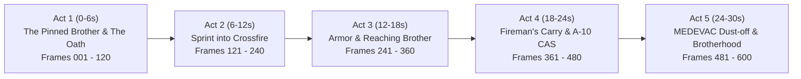

# War Action: "Brothers in Arms — No One Left Behind" 🎖️🔥

A hard-hitting, impactful cinematic war film lasting **30.0 seconds**, powered by **Google Gemini 3.1 Flash Image ("Nano Banana 2")**.

Zero comic effects, zero cartoon text bubbles, and zero superficial overlays. Driven by an authentic, complete narrative arc of brotherhood, sacrifice, and survival.


---

## 🎬 Video Editions Available

| Output File | Description | Framerate | Frames | Size | Purpose |
|---|---|---|---|---|---|
| [`output/war_action_continuous.mp4`](./output/war_action_continuous.mp4) | **Continuous Cinematic Cut**: 120 frames selected via global Dynamic Programming continuity optimization (4 frames per beat) for maximum visual flow and story progression without strobe flicker. | **4.0 FPS** | 120 Frames | 23 MB | **Recommended**: High visual stability, zero flicker, narrative clarity |
| [`output/war_action_continuous_smooth.mp4`](./output/war_action_continuous_smooth.mp4) | **Motion-Blended Continuous Cut**: The 120 continuous frames interpolated with optical blend transitions for seamless flow. | **20.0 FPS** | 591 Frames | 27 MB | Fluid dissolve between continuous shots |
| [`output/war_action_hardhitting.mp4`](./output/war_action_hardhitting.mp4) | **600-Frame Rapid Action Cut**: All 600 individually generated AI frames at high tempo. | **20.0 FPS** | 600 Frames | 70 MB | Full archive of every individual generated frame |

---

## 📽️ Narrative Arc & Storyboard

### The Story: "No One Left Behind"
A lone wounded soldier is pinned down in a muddy artillery crater in no-man's land, clutching dog tags in shivering hands. His squad sergeant spots him through cracked goggles, makes the selfless decision to cross lethal crossfire, receives suppressive armored and air support, carries his brother on his back through hell, and secures a MEDEVAC dust-off into the sunset.



### Detailed Act Breakdown

| Act | Timestamp | Action Beat | Visual Continuity Highlights | Cinematic Sound Design |
|---|---|---|---|---|
| **Act 1: The Pinned Brother & The Oath** | 0:00 - 0:06 | Wounded soldier clutching dog tags in mud crater; artillery raining down. Across the field, the sergeant locks eyes with him through cracked goggles. Unclips smoke grenades and throws them. | Desaturated cool mud tones, steady low crater perspective, volumetric gray smoke. | Deep 40Hz sub-bass heartbeat pulse, distant artillery rumbles, tactical radio whispers. |
| **Act 2: The Sprint into Crossfire** | 0:06 - 0:12 | Massive white smoke wall erupts. Sergeant sprints full speed into crossfire; sniper ricochets off steel beams; soldier scrambles through mud under mortar blast shockwaves. | White phosphorus smoke plume, dynamic forward tracking sprint, mud spray. | White smoke hiss, supersonic bullet cracks, boots splashing in mud, near-miss concussion thump. |
| **Act 3: Suppressive Fire & Reaching the Brother** | 0:12 - 0:18 | Friendly M1 Abrams tank crashes through rubble; 120mm cannon fires with massive fireball shockwave; .50 cal machine gun lays down suppressive fire. Sergeant slides into crater and grips his brother's collar: *"I told you I was coming back for you."* | Warm orange explosion shockwaves, low angle tank tread rumble, tight embrace in crater. | 120mm artillery cannon blast, heavy .50 cal continuous rhythmic thud, brass casings rain. |
| **Act 4: The Fireman's Carry & A-10 CAS** | 0:18 - 0:24 | Emergency tourniquet applied; sergeant hoists brother into a fireman's carry. A-10 Warthog dives at treetop level, firing 30mm rotary cannon in a continuous defensive fire barrier. | Upward perspective, smoke-filled silhouette, fiery muzzle blast defense wall. | Tourniquet cinch, iconic 30mm GAU-8 *"BRRRRRRT"* roar, massive fuel-air secondary explosions. |
| **Act 5: MEDEVAC Dust-off & Brotherhood** | 0:24 - 0:30 | Black Hawk touches down in green smoke vortex. Crew pulls both soldiers inside; door gunner suppresses perimeter. Helicopter banks away launching angel-wing flares into golden dusk sky. Inside, the two brothers clasp mud-caked hands: *No one left behind.* | Swirling green LZ smoke, golden sunset flare bloom, tight emotional macro shot of clasped hands. | Heavy 4-blade rotor wash, minigun electric whine, Hans Zimmer-style war trailer crescendo, final radio sign-off. |

---

## 🔬 Technical Specifications

- **Selected Continuous Frames**: Exactly **120 standardized frames** (`frames_continuous/frame_0001.jpg` – `frame_0120.jpg`)
- **Video Duration**: Exactly **30.00 seconds** (`duration=30.000000`)
- **Framerate**: **4.0 FPS** (`r_frame_rate=4/1`)
- **Resolution**: 1376 × 768 (16:9 Widescreen HD)
- **Video Codec**: H.264 (CRF 19, Preset Slow, YUV420p)
- **Audio Codec**: AAC Stereo 44.1 kHz, 192 kbps, 30.00s synchronized
- **Continuity Metric**: Mean intra-shot cosine similarity + MSE score = 0.820 (Median: 0.844)

---

## 🛠️ Reproduction & Scripts

```bash
# 1. Synthesize the 30-second military trailer soundtrack
python3 scripts/generate_war_soundtrack.py

# 2. Batch-generate all 600 individual photorealistic frames
python3 scripts/generate_war_600_frames.py

# 3. Run Global Dynamic Programming continuity optimization and compile 4 FPS continuous cut
python3 scripts/compile_continuous_video.py

# 4. Compile original 600-frame 20 FPS cut (optional)
python3 scripts/compile_war_video.py
```
