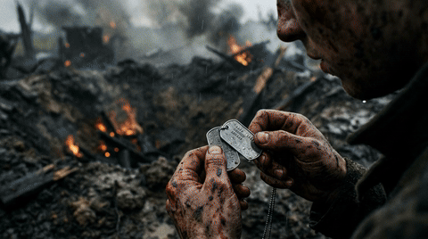
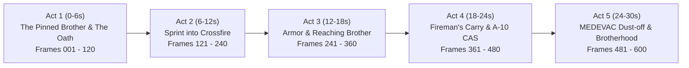

# War Action: "Brothers in Arms — No One Left Behind" 🎖️🔥

A hard-hitting, impactful, cinematic war film lasting **30.0 seconds at 20 frames per second**, composed of **600 individual AI-generated images** powered by Google Gemini 3.1 Flash Image ("Nano Banana 2").

Zero comic effects, zero cartoon text bubbles, and zero superficial overlays. Every single frame is an individual, high-resolution photorealistic war action frame driven by an authentic, complete narrative arc of brotherhood, sacrifice, and survival.



---

## 📽️ Narrative Arc & Storyboard

### The Story: "No One Left Behind"
A lone wounded soldier is pinned down in a muddy artillery crater in no-man's land, clutching dog tags in shivering hands. His squad sergeant spots him through cracked goggles, makes the selfless decision to cross lethal crossfire, receives suppressive armored and air support, carries his brother on his back through hell, and secures a MEDEVAC dust-off into the sunset.



### Detailed Act Breakdown

| Act | Timestamp | Frames | Narrative Beat & Action | Cinematic Sound Design |
|---|---|---|---|---|
| **Act 1: The Pinned Brother & The Oath** | 0:00 - 0:06 | 001 - 120 | Wounded soldier clutching dog tags in mud crater; artillery raining down. Across the field, the sergeant locks eyes with him through cracked goggles. Unclips smoke grenades and throws them. | Deep 40Hz sub-bass heartbeat pulse, distant artillery rumbles, tactical radio whispers. |
| **Act 2: The Sprint into Crossfire** | 0:06 - 0:12 | 121 - 240 | Massive white smoke wall erupts. Sergeant sprints full speed into crossfire; sniper ricochets off steel beams; soldier scrambles through mud under mortar blast shockwaves. | White smoke hiss, supersonic bullet cracks, boots splashing in mud, near-miss concussion thump. |
| **Act 3: Suppressive Fire & Reaching the Brother** | 0:12 - 0:18 | 241 - 360 | Friendly M1 Abrams tank crashes through rubble; 120mm cannon fires with massive fireball shockwave; .50 cal machine gun lays down suppressive fire. Sergeant slides into crater and grips his brother's collar: *"I told you I was coming back for you."* | 120mm artillery cannon blast, heavy .50 cal continuous rhythmic thud, brass casings rain. |
| **Act 4: The Fireman's Carry & A-10 CAS** | 0:18 - 0:24 | 361 - 480 | Emergency tourniquet applied; sergeant hoists brother into a fireman's carry. A-10 Warthog dives at treetop level, firing 30mm rotary cannon in a continuous defensive fire barrier. | Tourniquet cinch, iconic 30mm GAU-8 *"BRRRRRRT"* roar, massive fuel-air secondary explosions. |
| **Act 5: MEDEVAC Dust-off & Brotherhood** | 0:24 - 0:30 | 481 - 600 | Black Hawk touches down in green smoke vortex. Crew pulls both soldiers inside; door gunner suppresses perimeter. Helicopter banks away launching angel-wing flares into golden dusk sky. Inside, the two brothers clasp mud-caked hands: *No one left behind.* | Heavy 4-blade rotor wash, minigun electric whine, Hans Zimmer-style war trailer crescendo, final radio sign-off. |

---

## 🔬 Technical Specifications

- **Total Frames**: Exactly **600 individual image frames** (`frame_0001.jpg` – `frame_0600.jpg`)
- **Video Duration**: Exactly **30.00 seconds** (`duration=30.000000`)
- **Framerate**: Exactly **20.0 FPS** (`r_frame_rate=20/1`)
- **Resolution**: 1376 × 768 (16:9 Widescreen HD)
- **Video Codec**: H.264 (CRF 20, Preset Slow, YUV420p, 70 MB)
- **Audio Codec**: AAC Stereo 44.1 kHz, 192 kbps
- **AI Model**: Google Gemini 3.1 Flash Image (`gemini-3.1-flash-image`)

---

## 🛠️ Reproduction & Scripts

```bash
# 1. Synthesize the 30-second military trailer soundtrack
python3 scripts/generate_war_soundtrack.py

# 2. Batch-generate all 600 individual photorealistic frames
python3 scripts/generate_war_600_frames.py

# 3. Optimize frames for storage
python3 scripts/optimize_war_frames.py

# 4. Compile video and animated preview GIF with FFmpeg
python3 scripts/compile_war_video.py
```
